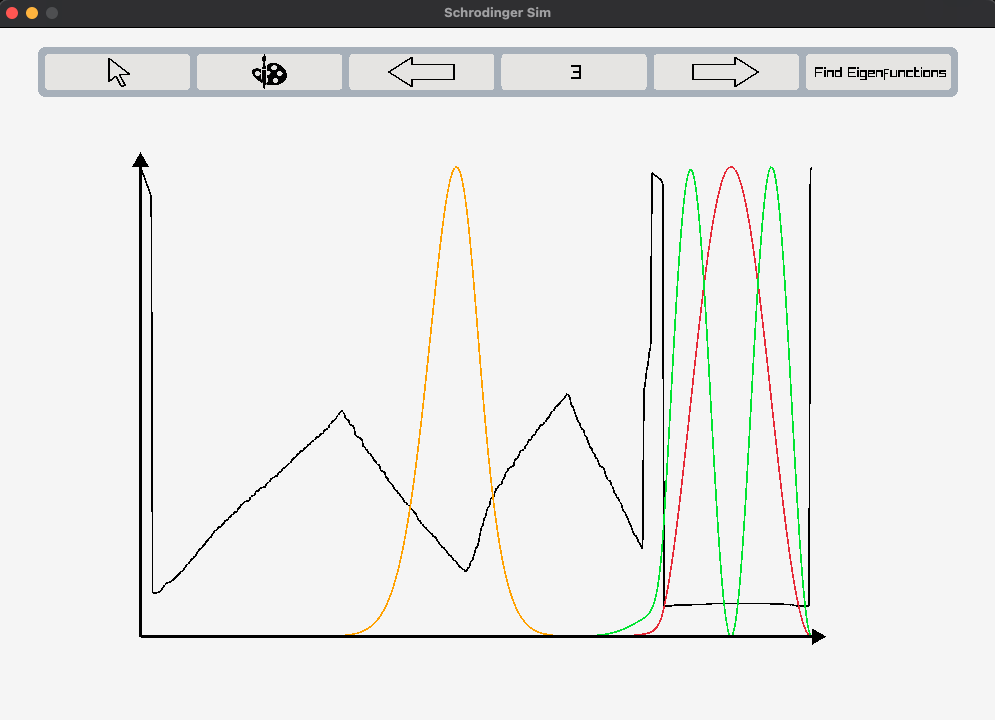

# SchrodingerSim
WIP

SchrodingerSim is a application to simulate quantum wave function evolution for any time-independent potential that is defined within a well. That is, all wavefunctions have boundary conditions that $\psi(x=0) = \psi(x=L) = 0$. The application displays the evolution of the probability wavefunction.

Below are some sample images. The black line represents the potential while the colored lines are some of the corresponding eigenstates.

*First 3 eigenstates of a quadratic potential*

*First 3 eiegenstates of a user-specified, drawn potential. Each eigenstate is most likely to be found in some potential well*
## Eigenstate Solver
Rather than some finite difference method, SchrodingerSim solves the eigenstates for a specific potential and uses those to find the time evolution of a general state.

## Demo

## Installation

SchrodingerSim is built on clang 15.0.0. Make sure your system has clang and is accessible through the path.

SchrodingerSim heavily depends on [Raylib](https://github.com/raysan5/raylib) for the display and interactivity of the simulation. Furthermore, this repo contains an implementation of a HashMap in C written by [tidwall](https://github.com/tidwall/hashmap.c).

### Apple Silicon Mac 
There are two options:

1. Clone this repository and continue to [below](#Usage)
2. TODO (download .dmg)

### Other Systems
SchrodingerSim is entirely self-contained except for Raylib, which must be compiled and statically linked to SchrodingerSim.

First clone the [raylib](https://github.com/raysan5/raylib) library and follow instructions [here](https://github.com/raysan5/raylib/discussions/3608) to compile the library into `libraylib.a`. Locate this file and replace the newly created file with the old one in `lib/`. With that, you should be all set.

## Usage & Controls

After the steps above, simply run `make run` in this directory.

 **Controls**:
|Key|Action| 
|---| --- |
|Space|Pause/Resume|
|Right-Click + Drag | Pan Camera|
|Scroll Wheel | Zoom |

**GUI Controls**

## Authors
Akash Piya
